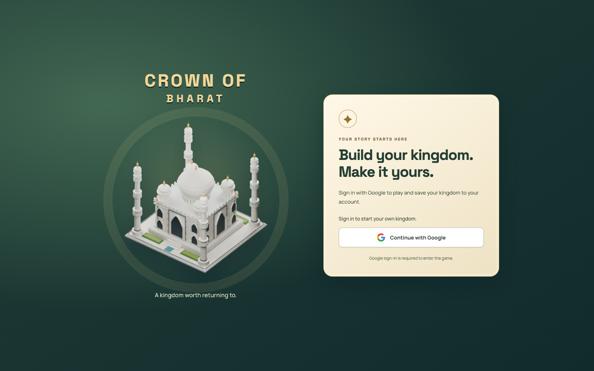

# Crown of Bharat

Indian-inspired 3D strategy game: build a kingdom, upgrade buildings, prepare troops and heroes, and play campaign, practice, or asynchronous online battles. The deployed entry screen is branded **Crown of Bharat**.

[Play the game](https://crown-of-bharat.vercel.app/) · [Deployment setup](DEPLOYMENT.md) · [Game systems](monsoon-kingdoms/README.md)



[Phone entry-screen screenshot](docs/screenshots/mobile.png). Captured from production on September 15, 2026. These images show the actual Google sign-in gate, not an authenticated gameplay session.

## Run locally

Requirements: Node.js, npm, Python 3, a browser with WebGL, and working Firebase configuration for the authorized local origin.

```sh
git clone https://github.com/robinfrancis186/crown-of-bharat.git
cd crown-of-bharat
npm ci
npm start
```

Open http://localhost:5191/monsoon-kingdoms/. Google sign-in and a successful initial Firestore read are required before play. For your own deployment, configure your Firebase project, authorized domains, and Firestore rules; frontend startup alone does not activate cloud services.

Mobile gameplay is designed for landscape orientation. Drag to pan, pinch or scroll to zoom, select buildings for their actions, and use the attack controls to enter battles.

## Architecture

- `monsoon-kingdoms/src/main.js` coordinates the game loop and account readiness.
- `src/rules.js`, `src/view.js`, and `src/ui.js` inside that directory separate rules, Three.js rendering, and controls.
- `src/account.js` and `src/account-store.js` require Google identity and manage per-user saves in Firestore, with local recovery state.
- `src/net.js` connects online village/battle features to Supabase RPCs.
- Runtime assets and authoring tools live under `monsoon-kingdoms/assets/` and `monsoon-kingdoms/tools/`.

## Verify and build

```sh
npm test
npm --prefix monsoon-kingdoms run test:fast
npm run build
```

The test commands cover game rules, progression, storage, account-store behaviour, layouts, and asset checks. `npm run build` creates the standalone release package. Vercel uses the fast checks and release builder configured in `vercel.json`.

The September 2026 documentation review captured desktop and narrow-screen entry views. It does not claim a fresh authenticated cloud-save test or physical-device performance measurement. Online services must be configured separately; this is not a synchronous multiplayer or server-validated battle system.

## Contribution history

[Commit history](https://github.com/robinfrancis186/crown-of-bharat/commits/main/) records the game, account integration, and asset-authoring work. Existing contributor and asset attribution is preserved.

## Licensing

No repository-wide LICENSE file is included. This documentation grants no new permissions. Third-party code, artwork, datasets, and trademarks retain their respective terms; contact the maintainers to clarify project-owned asset and code permissions before redistribution.
