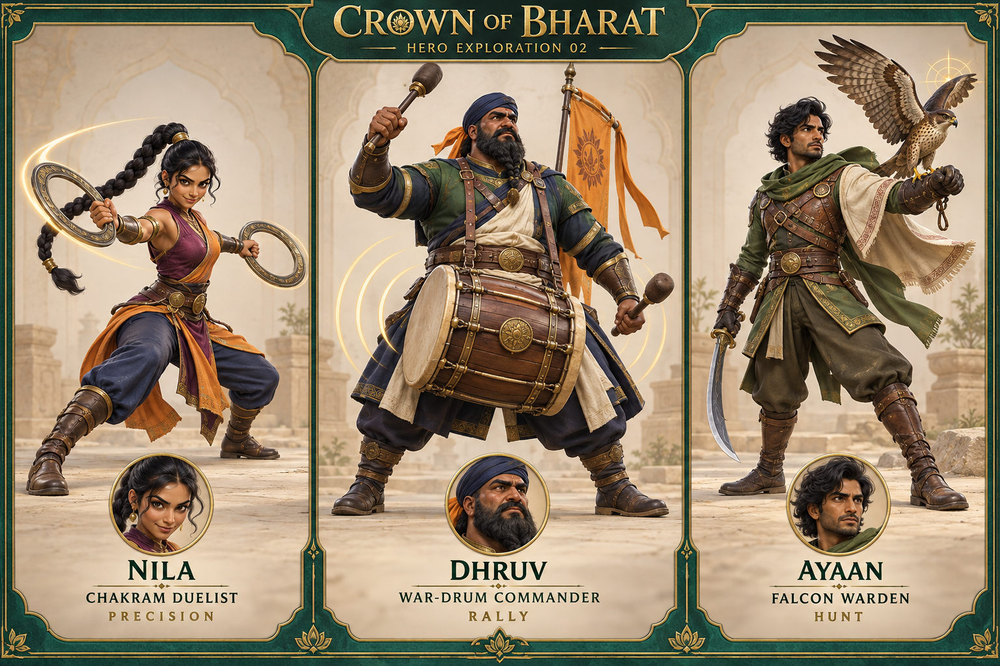

# Crown of Bharat — hero exploration 02

Original second concept lineup, generated with the built-in imagegen tool. The user selected Nila and Ayaan from this board, plus Ira and Kabir from lineup-v1, for playable implementation. Dhruv remains an unimplemented concept.



## Generation prompt

```text
Use case: stylized-concept
Asset type: one original hero exploration board for Crown of Bharat, an Indian-inspired mobile village strategy game.
Primary request: a distinctly different second trio of potential heroes, with new personalities, weapons and tactical roles. Do not reuse the parasol woman, brass engineer or elephant rider from the previous direction.
Scene/backdrop: warm ivory character-design studio with subtle sandstone plinths and very faint carved arch outlines. Keep most of the background uncluttered, no busy palace scenery. A premium emerald and antique-gold graphic frame unites three equal-width bays.
Style/medium: exceptional polished stylized 3D game character sculpture, heroic expressive faces, slightly exaggerated heads/hands, substantial modeling-friendly forms, realistic cloth, leather and metal response. Fine detail supports broad readable silhouettes. A coherent cast for future Blender models, not live action and not a flat illustration. Three adult fictional Indian heroes total.
Composition: wide landscape roster concept board, three complete full-body characters in three-quarter views, all heads, footwear, weapons, banners and birds comfortably within the image with generous edge margin. Comparable scale. Feet planted with soft accurate contact shadows. Each bay includes one small circular close-up face portrait at the bottom, clearly matching that hero. Clear readable aligned labels under each character. No stats or cluttered UI.
LEFT — NILA, CHAKRAM DUELIST: athletic adult Indian woman with warm brown skin and a sharp playful confident expression, dark hair in a high long braided ponytail. Deep plum and saffron-orange asymmetrical fitted combat tunic over indigo trousers, sculpted antique-brass forearm guards, practical boots, short split cloth panels that show both legs. One large polished throwing chakram ring held outward in each hand; both rings have open centers and recognizable simple circular silhouettes. Low balanced dynamic martial-arts stance on the ground, one knee flexed, ready to dash. No shield, no sword, no parasol, no giant crown. A subtle single curved motion ribbon behind one ring suggests a precision ricochet attack without hiding anatomy.
CENTER — DHRUV, WAR-DRUM COMMANDER: broad, powerful adult Indian man in his forties with medium-brown skin, a disciplined determined expression, thick neatly braided black beard, dark navy headwrap with a modest orange cloth tail. Forest-green and navy armored coat, ivory sash, wide leather belt, padded dark trousers and strong boots. A large double-sided cylindrical wooden war drum strapped securely across the front of his hips, polished wood shell, thick leather straps and brass hoops, entirely visible. Holds two substantial wooden drum beaters, one raised in preparation. A tall narrow saffron command banner rises from a harness behind one shoulder, its whole finial visible. Grounded commanding stance. He is a field commander rather than an engineer: no goggles, gears, mechanical backpack, robotic pet or mallet. Subtle warm concentric rhythm rings close to the drum suggest army rallying.
RIGHT — AYAAN, FALCON WARDEN: lean athletic adult Indian man, deep brown skin, clean-shaven or light stubble, watchful expressive face, wavy black hair, small swept cloth scarf. Moss-green layered ranger jacket with tan leather chest harness and dark olive trousers, one short cream shoulder cape, brass belt clasp, leather boots. One magnificent natural brown-and-cream falcon perched securely on his thick gloved forearm, wings half-open and fully visible; falcon clearly an animal companion, not mechanical or a fantasy humanoid. His other hand holds a short curved saber pointed safely down. Slightly turned alert scouting stance, eyes toward a distant target. No bow, no turban, no elephant, no long spear. Bird and forearm form a unique strong silhouette. Small restrained golden targeting glint near the falcon suggests identifying a priority defense.
Lighting: warm soft key, gentle cool fill, subtle rim highlights, believable ground contact, bright readable faces, premium sculpted miniature material quality.
Text verbatim: at top "CROWN OF BHARAT" and small "HERO EXPLORATION 02". Left labels "NILA", "CHAKRAM DUELIST", "PRECISION". Center labels "DHRUV", "WAR-DRUM COMMANDER", "RALLY". Right labels "AYAAN", "FALCON WARDEN", "HUNT". Elegant bold readable typography, perfectly aligned baselines and consistent spacing, no extra text.
Constraints: visually original fictional characters, no copied game heroes, no real celebrity likenesses, no deities or religious symbols, no modern guns, no gore, no floating human characters. Three distinct silhouettes: twin circular blades, broad drum and banner, falcon wing. No cropped accessories or distorted hands. High-resolution concept art suitable for comparing the next game heroes.
```
