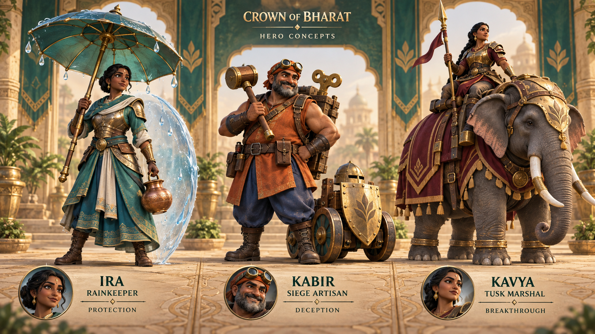

# Crown of Bharat — next hero concepts

Generated 15 September 2026 using the built-in imagegen tool. This is concept art and proposed gameplay, not implemented or balanced game content. Existing hero definitions were checked in src/rules.js: Veer is a frontline fighter with Battle Cry; Captain Tara is ranged with Arrowstorm.



## Recommended order

1. **Ira the Rainkeeper — protection/support.** A teal rain parasol and copper vessel make a clear round silhouette. **Monsoon Canopy:** place a temporary protective water canopy over a small group of nearby troops to absorb incoming projectiles. Slow movement and modest attack damage make positioning important. Her role is preventing damage to allies, extending the roster beyond Veer's self-heal and Tara's ranged burst. First prototype should test the canopy's radius, absorption budget, duration and interaction with splash attacks; exact stats remain undecided.
2. **Kabir the Siege Artisan — deception/control.** An orange coat, brass winding-key pack and wheeled shield decoy make a square silhouette. **Clockwork Decoys:** send two fragile mechanical decoys ahead to draw defense fire while the army advances. Decoys deal no damage and expire; area attacks can destroy both. Prototype defense retargeting and ensure ordinary enemies cannot be distracted indefinitely.
3. **Kavya the Tusk Marshal — mounted breakthrough.** Burgundy armor, a gold brow plate and one commanding elephant form the largest silhouette. **Siege March:** commit to a short straight charge that breaches a wall line, followed by a brief recovery. Slow turns and a visible charge wind-up distinguish her from ordinary Elephant Riders and leave room for careful positioning. Prototype pathfinding, intact/destroyed wall interaction, mount contact and recovery before setting damage values.

## Art and modeling direction

Keep the color, silhouette and face reads when reduced to mobile card sizes. The board establishes a polished stylized target, above the current in-game model detail. It is not proof of an achieved runtime look or frame rate. Simplify engraving in gameplay meshes, retain wide clear forms, and reserve intricate detail for portraits. Ira and Kabir require grounded walking rigs; Kavya needs a four-legged gait and an independently animated seated rider. Preview ground contact and portrait crops in the actual landscape camera.

The generated board was visually checked for three distinct heroes, readable names, consistent material treatment and grounded poses. It is a concept presentation, not an orthographic modeling turnaround; separate front/side/back sheets would be the next art-production step.

## Generation record

- Mode: built-in imagegen; no API-key fallback used.
- Image: lineup-v1.png, copied without edits from the tool output.
- Source: /Users/robinfrancis/.codex/generated_images/01a075f2-57cf-7be0-ba02-d4b372a5670c/exec-24a39735-e1ca-4fd4-97be-6dea7d56fa6d.png
- No game code or live deployment changed for this concept exploration.

## Final generation prompt

```text
Use case: stylized-concept
Asset type: one landscape hero-roster concept board for Crown of Bharat, an original Indian-inspired mobile village strategy game. Brainstorming artwork, not an in-game screenshot.
Primary request: design the next three distinct fictional heroes in one cohesive premium 3D character lineup. The existing game uses teal and brass warriors, Indian-inspired architecture, rounded readable forms and warm physical lighting. Evolve this into beautifully crafted stylized 3D character art suitable for future Blender modeling and a small landscape phone screen.
Scene/backdrop: refined warm ivory studio with subtly engraved sandstone floor, emerald framing and soft atmospheric depth. Three spacious equal-width presentation bays, understated dividers, coherent scale and camera. No busy village or battle behind them.
Composition/framing: wide landscape, three full-body hero concepts, everything including weapons, parasol, elephant and feet contained in frame. Character silhouettes must be unmistakably different when shrunk to a thumbnail. Each hero has a small consistent close-up portrait inset to show the proposed army-card crop. Labels below each bay, never over characters.
LEFT — IRA THE RAINKEEPER: an adult Indian woman, poised and compassionate but battle-ready, deep brown skin, expressive dark eyes, black hair in a practical braided bun. Teal layered travel robes over fitted light silver and brass armor, ivory sash, sturdy boots. Her signature silhouette is a broad round teal rain parasol held above one shoulder, with a strong brass shaft, large simple petal-like panels and a few suspended clear droplets. In her other hand a compact copper water vessel. A restrained translucent curved water shield beside her suggests a protective support ability. Her two feet visibly planted, no levitation. Avoid deity imagery or religious emblems.
CENTER — KABIR THE SIEGE ARTISAN: an adult Indian male master engineer, stocky and broad, warm brown skin, short salt-and-pepper beard, intelligent mischievous expression. Rust-orange sleeveless work coat, indigo trousers, leather bracers and solid work boots, protective brass goggles pushed onto a compact cloth headwrap. A rugged wood-and-brass tool pack with one oversized winding key creates a square silhouette. Holds a chunky engineering mallet. One small original wheel-driven brass shield decoy at his feet, clearly a mechanical construct with two broad wheels and a large shield front, no modern robot or firearm. Broad shapes and functional joints, restrained fine detail.
RIGHT — KAVYA THE TUSK MARSHAL: an adult Indian woman, imposing confident commander with brown skin and braided black hair, wearing burgundy cloth and antique gold lamellar armor. Seated securely in a low practical saddle on a powerful compact Indian elephant, her entire mount visible including all four weight-bearing feet and trunk. Broad burgundy caparison with simple gold geometry, padded harness, protective brass brow plate, natural living animal anatomy and relaxed ears. Holds a short command spear upright. The elephant is the largest silhouette, about 1.3 times the total height of the standing heroes, proportionately powerful rather than gigantic. No extra riders. No deity references.
Style/medium: highly polished stylized 3D game character sculptures, charming heroic faces, slightly exaggerated heads and hands, believable joint anatomy, clear modeling-friendly separate armor pieces. Soft sculpted surfaces, real cloth weave, worn leather, satin brass, controlled ornamental inlay; rich but not noisy detail. Not flat illustration, not photoreal people, not voxel art.
Lighting/mood: warm soft key light, gentle cool fill, strong grounded contact shadows under every foot, pleasant rich colors, clean readable faces and materials.
Text (verbatim): small heading "CROWN OF BHARAT" and "HERO CONCEPTS". Under left "IRA" then "RAINKEEPER" then "PROTECTION". Under center "KABIR" then "SIEGE ARTISAN" then "DECEPTION". Under right "KAVYA" then "TUSK MARSHAL" then "BREAKTHROUGH". Elegant chunky readable game typography, excellent alignment, no other text.
Constraints: original character designs, no copied Supercell characters or logos, no real celebrity likenesses, no modern sci-fi guns, no gore, no mystical levitating ground units, no tiny illegible interface panels, no watermark. Three hero designs total, not an extra crowd. Premium high-resolution concept art.
```
